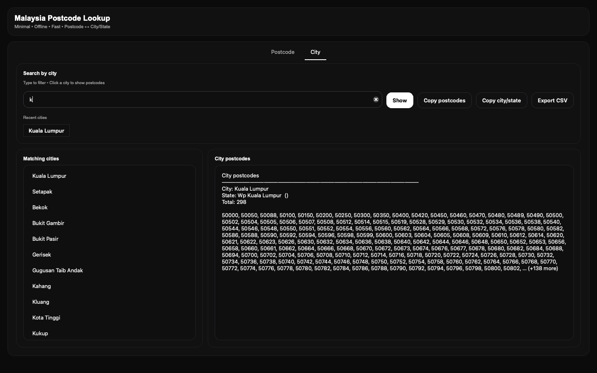
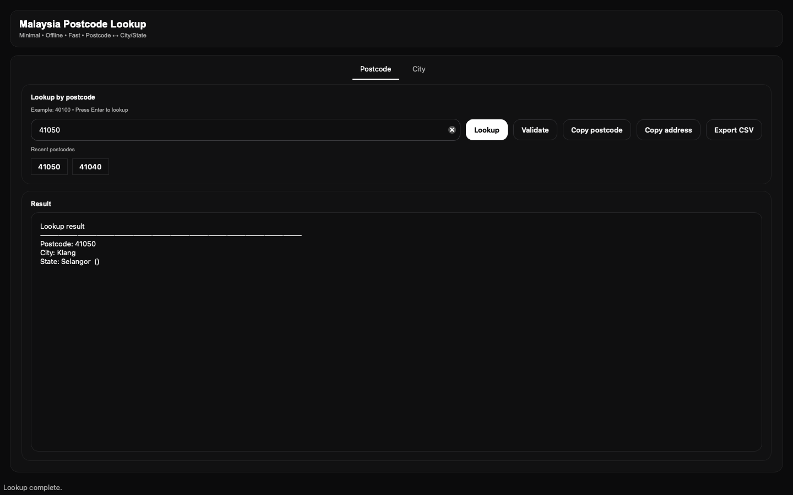

# Malaysia Postcode Lookup (Desktop Application)

A minimal, cross-platform desktop application for fast, offline Malaysian postcode lookup.  
This project focuses on UI/UX improvements and application-level functionality built on top of an existing open-source postcode dataset.

---

## Preview

<p align="center">
  
  
</p>

---

## Project Overview

This application provides an intuitive desktop interface for searching Malaysian postcodes and cities without requiring internet access.  
It is designed for end users who prefer a clean, professional UI rather than interacting with raw datasets or command-line tools.

This repository is **not a reimplementation of the postcode dataset**.  
Instead, it is a **UI and application-layer adaptation** of an existing open-source project.

---

## Enhancements and Modifications

Compared to the original dataset repository, this project introduces:

- Desktop graphical user interface (GUI)
- Offline indexed postcode lookup for faster performance
- Postcode to city/state lookup
- City to postcode list lookup
- Rounded search chips for recent searches
- Clear input buttons for improved usability
- Copy functions:
  - Postcode only
  - Formatted address string
- CSV export for lookup results
- Cross-platform packaging for macOS and Windows
- Minimal black-and-white visual design

---

## Technology Stack

- Python 3
- PySide6 (Qt for Python)
- PyInstaller (application packaging)

---

## Data Source and Attribution

This application is built using the Malaysian postcode dataset maintained by:

**Asyraf Hussin**  
**Fareez Iqmal**

Original repository:  
https://github.com/AsyrafHussin/malaysia-postcodes

The dataset is licensed under **Creative Commons Attribution 4.0 (CC BY 4.0)**.

Full credit and attribution are preserved in accordance with the license.  
This project does **not claim ownership of the postcode data**.

Special thanks to the original authors for providing and maintaining a high-quality, open dataset.

---

## Author and Application Development

Application design, UI/UX, and system integration by:

**Gajee | Ghub Studio**

Scope of work:
- Desktop application architecture
- User interface design
- Performance optimization
- Cross-platform build configuration

---

## Download and Usage (End Users)

### macOS
1. Download the application from the **Releases** section.
2. Open `Malaysia Postcode Lookup.app`.
3. If blocked by macOS security, go to:
   - System Settings → Privacy & Security
   - Select “Open Anyway”.

### Windows
1. Download the `.exe` file from **Releases**.
2. Double-click to launch the application.
3. No Python installation required.

The application runs fully offline.

---

## Development Setup

For developers who wish to run or modify the project:

```bash
git clone https://github.com/YOUR_USERNAME/malaysia_postcode_app.git
cd malaysia_postcode_app
pip install pyside6
python app_qt.py
Build Standalone Application
macOS
pyinstaller --windowed --add-data "data:data" app_qt.py
Windows
pyinstaller --windowed --add-data "data;data" app_qt.py
